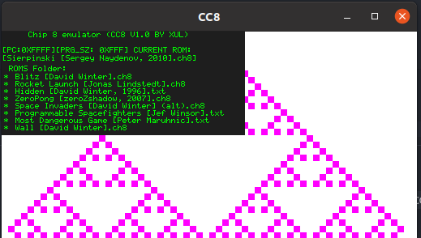
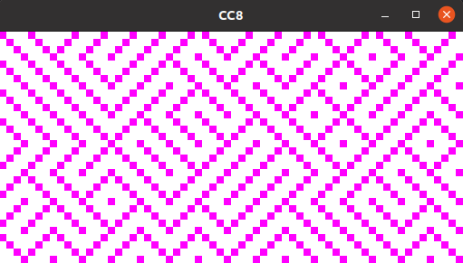

# MIEMU
Minimalist emulator implementations (IN-PROGRESS)

## Features
- Most minimal impementation (lightweight)
- Minimal dependency count
    - SDL_2
- Emulator UI
    - Shell
        - Emulation control (start, stop, reset)
        - File explorer 
- Portable code
    - Linux (ubuntu/debian)
- Emulation engine api
    - runs any emulator implemented on the Emulation api
        - hotswapable and multi-emulator system
- Implementations
    - Chip 8

Check the [road map](DOCS/emu_roadmap.md) for development notes uwu

## CC8 Overview (C CHIP-8 EMULATOR) 

Emulator UI Shell (WIP)

Maze (David winter)

## GAME BOY (W.I.P) 
- TODO...

## Resources

Chip 8 test suite
* https://github.com/Timendus/chip8-test-suite

Chipo 8 roms
* https://github.com/kripod/chip8-roms

## Authors
* TODO!!!
