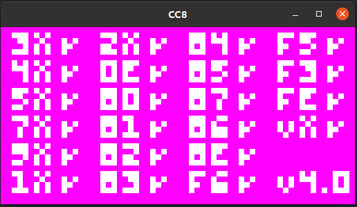
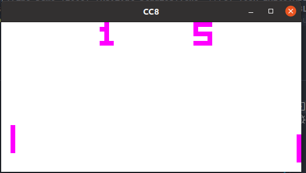
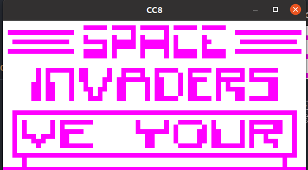

# CC8
Chip 8 portable lib for embbed devices (WIP)

Todos:
- Multi room selector (from folder)
    - Emulator ui frame buffer 
    - Emulator ui 
        - Basic file explorer
        - Debug ???
- uDisplay implementation (https://github.com/54UL/uDisplay/)
- PSP SDL PORT

## Overview

Corax+ opcode test

Maze (David winter)

Pong game 1P

Space invaders (David winter)

Emulator UI Shell (WIP)

## Programs and rooms resources

Chip 8 test suite
* https://github.com/Timendus/chip8-test-suite

Chipo 8 roms
* https://github.com/kripod/chip8-roms

